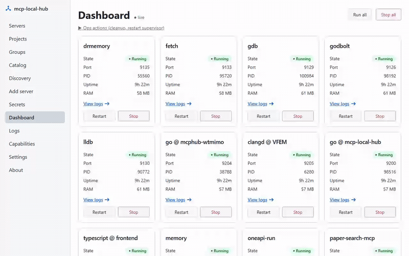

# mcp-local-hub

**One managed local hub for every MCP server you use — `N` duplicate processes per server collapse to `1` shared daemon.**

Run one copy of each [Model Context Protocol](https://modelcontextprotocol.io) server on your workstation, shared across every MCP client that needs it — instead of each client spawning its own redundant stdio process. Install the binary (`mcphub`) once with `npm`, point your clients at the hub, and stop paying for the same server `N` times.



<!-- TODO(hero): the GIF above is the GUI tour (the "after" — one managed fleet). A short terminal clip of the npm install + the before/after process-count drop can be stitched in front; recording scenario in .scratch/gif/approach-A-terminal-scenario.md. -->

> [!WARNING]
> Preview version: `mcp-local-hub` is actively under development. Interfaces,
> manifests, GUI flows, install/migration behavior, and supported-client wiring
> may still change. Windows 11 is the primary tested path, but not every
> feature, server, client combination, or platform path is fully tested yet; use
> dry-runs and backups before applying changes to important MCP client configs.

## Install (npm)

The fastest path — the npm distribution is generally available. The npm
**package** is `mcp-local-hub`; the **command** it installs is `mcphub`.

```bash
# 1. Install the binary globally (the command it installs is `mcphub`)
npm install -g mcp-local-hub

# 2. Put mcphub on your PATH and register state (idempotent)
mcphub setup

# 3. Open the GUI — install servers with one click, see every daemon's health
mcphub gui
```

```bash
# Or run once without installing:
npx mcp-local-hub version
```

The meta package ships **no `postinstall` download script** (the top npm
supply-chain attack vector) — npm installs only the platform binary that
matches your `os`/`cpu` via an optional dependency, and a tiny Node shim execs
it. Building from source is still supported for dev iteration — see
[Building from source](#building-from-source) below.

Detailed setup, per-client behaviour, and troubleshooting in [INSTALL.md](INSTALL.md).

## Why mcphub — the problem and the cure

**The problem.** Every modern coding assistant (Claude Code, Codex CLI, Cursor, VS Code, Gemini CLI, Qwen Code CLI, Antigravity, Continue, ...) speaks MCP, and each client independently `exec`s whatever stdio servers you configure — `uvx serena`, `npx @modelcontextprotocol/server-memory`, `mcp-language-server`, and so on. Run three assistants side-by-side on the same project and you get **three Serena processes**, **three gopls subprocesses**, **three separate memory stores**. Scale that across the editors, agents, and CLIs a working developer keeps open and you get **dozens of duplicate `node`/`python` processes** — each per-session spawn re-downloads dependencies, re-indexes your code, and eats RAM, all to do the same work the process next to it is already doing.

**The cure.** `mcp-local-hub` is one managed local hub: install once, and every client routes through it. Each MCP server runs **once per OS user**, supervised, restarted on failure, and shared — so the process tail compresses from **`N` duplicate procs → `1` managed daemon each**.

## What this tool does

`mcp-local-hub` runs each MCP server **once per OS user**, exposes it as a local HTTP endpoint via [Streamable HTTP transport](https://modelcontextprotocol.io/docs/concepts/transports), and writes the correct client-config entry into each managed MCP client. Clients see a shared daemon instead of their own child process.

```
  MCP clients                      mcphub                  shared daemons
  (Claude Code,                                            (one per server,
   Codex, Cursor,        ┌──────────────────────┐           per OS user)
   VS Code, Gemini,      │   mcphub supervise   │         ┌──────────────┐
   Qwen, …)              │  ───────────────────  │   ┌────▶│ serena ×2    │
                         │  supervisor: owns,    │   │     ├──────────────┤
   ┌──────────┐  HTTP    │  restarts, shares     │   ├────▶│ memory       │
   │ client A │ ───────▶ │  every daemon         │ ──┤     ├──────────────┤
   ├──────────┤  HTTP    │                       │   ├────▶│ godbolt …    │
   │ client B │ ───────▶ │  (HTTP front +        │   │     ├──────────────┤
   ├──────────┤  HTTP    │   stdio-host /        │   └────▶│ +7 more      │
   │ client C │ ───────▶ │   embedded Go)        │         └──────────────┘
   └──────────┘          └──────────────────────┘
```

Each MCP server runs **once per OS user**; every client shares the same
daemon over loopback HTTP instead of spawning its own copy. See
[docs/supervisor-architecture.md](docs/supervisor-architecture.md) for the
full lifecycle, state-file layout, migration, and per-OS behavior.

Stdio-only MCP servers (memory, time, sequential-thinking, wolfram, gdb, paper-search-mcp) run behind a native Go **stdio-host** (`internal/daemon/host.go`): one subprocess per daemon, multiplexed across concurrent HTTP clients via JSON-RPC `id` rewriting and a cached `initialize` response. Four servers (**godbolt**, **lldb-bridge**, **perftools**, **vcpkg**) ship as Go code **embedded directly in the mcphub binary** — no npm/pip dependency, starts instantly.

Antigravity's Cascade agent rejects loopback-HTTP MCP entries, so `mcp-local-hub` bridges it via a **stdio relay subprocess**: `mcphub relay` translates between stdio JSON-RPC and the shared HTTP daemon. Cascade sees a normal stdio command; the daemon stays shared.

## Building from source

The npm install above is the fastest path. To build from source instead — for
dev iteration or to embed your own version metadata:

```bash
# 1. Build (embeds git commit + build date into the binary)
bash build.sh        # Git Bash / WSL / Linux / macOS
# or on Windows native:
pwsh ./build.ps1

# Plain `go build -o mcphub.exe ./cmd/mcphub` also works for dev
# iteration but leaves version metadata as dev/unknown.

# 2. Install to ~/.local/bin and register on user PATH (idempotent)
./mcphub.exe setup
```

Whether you installed via npm or built from source, the rest is identical — use
the CLI to install the servers you want shared and verify they connect:

```bash
# Install the MCP servers you want shared
mcphub install --server serena       # default clients: Claude/Codex/Cursor
mcphub install --all                 # all 15 global servers, default clients

# Materialize one server in supervisor intent without touching client configs
mcphub install --server fetch --no-client-config

# Optional client targeting
mcphub install --server serena --clients qwen-cli,vscode
mcphub install --server serena --all-clients

# Verify
mcphub status
claude mcp get serena    # shows: Status: ✓ Connected, Type: http
```

## Eleven highlighted servers

The binary embeds 16 manifests. `mcphub install --all` installs the 15 global
servers; `mcp-language-server` is workspace-scoped and is materialized through
`mcphub register`. The table below highlights 11 commonly used servers rather
than claiming to enumerate the complete embedded catalog.

| Server | Port | Transport | Notes |
|---|---:|---|---|
| **serena** (×2 daemons) | 9121 / 9122 | native-http (uvx) | Flagship: per-client daemons (claude / codex) for context isolation |
| **memory** | 9123 | stdio-bridge (npx) | Shared JSONL write-serialized across all clients |
| **sequential-thinking** | 9124 | stdio-bridge (npx) | Stateless reasoning helper |
| **wolfram** | 9132 | stdio-bridge (node) | Requires `wolfram_app_id` secret |
| **godbolt** | 9126 | **embedded Go** | Compiler Explorer — compile/execute/disasm via godbolt.org + optimization remarks, llvm-mca, pahole |
| **paper-search-mcp** | 9127 | stdio-bridge (uvx) | Requires `unpaywall_email` secret |
| **time** | 9128 | stdio-bridge (npx) | Trivial stateless |
| **gdb** | 9129 | stdio-bridge (uv run) | Multi-debugger with session management |
| **lldb** | 9130 | **embedded Go bridge** | Auto-spawns `lldb.exe`, HTTP-multiplexes concurrent clients onto single TCP connection |
| **perftools** | 9131 | **embedded Go** | clang-tidy + llvm-objdump + include-what-you-use over real projects; `hyperfine` is **opt-in only** (RCE surface — set `MCP_LOCAL_HUB_ENABLE_UNSAFE_HYPERFINE=1`, see INSTALL) |
| **vcpkg** | 9138 | **embedded Go** | vcpkg/CMake diagnostics — build-failure triage across nested builds, overlay-port precedence, pin auditing, static patch-apply order, CMake include graph. Read-only: never starts a build. Every tool answers `ok\|failed\|unknown(reason)`; see `servers/vcpkg/README.md` for how to read the verdicts |

Plus **context7** as a direct HTTPS entry (no daemon, no scheduler task).

### Embedded vs external servers

Four servers (`godbolt`, `lldb-bridge`, `perftools`, `vcpkg`) are implemented as Go packages inside `internal/<name>/` and run as subcommands of the mcphub binary itself — no external runtime dependency. The first three also ship as independent standalone binaries via `go build ./cmd/<name>` for users who want just that one server without the full hub. `vcpkg` intentionally follows the hub-only in-binary pattern and has no standalone `cmd/vcpkg` executable.

**Performance-review workflow** combining multiple servers in one chat:

```
# audit real project for perf antipatterns
perftools.clang_tidy(files=["src/hot.cpp"], checks="performance-*")

# sanity-check asm on godbolt with optimization remarks
godbolt.compile_code(source=..., filters={optOutput: true, intel: true})

# statistical bench (requires opt-in: MCP_LOCAL_HUB_ENABLE_UNSAFE_HYPERFINE=1 on
# the perftools daemon — see INSTALL.md "Opting into hyperfine")
perftools.hyperfine(commands=["./old_bin", "./new_bin"], warmup=3)

# verify the LTO-linked final binary keeps the vectorization
perftools.llvm_objdump(binary="./new_bin", project_root=".", function="hot_loop")
```

## Supported clients

Default install targets are `claude-code` and `codex-cli`.
`cursor`, `vscode`, `gemini-cli`, `qwen-cli`, `antigravity`, `zed`, `kiro`, `windsurf`,
`cline`, `kilocode`, `opencode`, `hermes`, and `openclaw` are opt-in via
`--clients ...` or `--all-clients`, so install does not silently mutate every
assistant installed on the workstation.

| Client | Install mode | Version/status | Config path | Transport |
|---|---|---|---|---|
| Claude Code CLI | Default | 2.1.112 tested | `~/.claude.json` | HTTP (`type: "http"`) |
| Codex CLI | Default | 0.121.0 tested | `~/.codex/config.toml` | HTTP (streamable_http) |
| Cursor | Opt-in | Preview; live smoke pending | `~/.cursor/mcp.json` | HTTP (`type: "http"`) |
| VS Code | Opt-in | Preview; live smoke pending | user-profile `mcp.json` | HTTP (`type: "http"`) |
| Gemini CLI | Opt-in | 0.38.1 tested | `~/.gemini/settings.json` | HTTP (`type: "http"`) |
| Qwen Code CLI | Opt-in | Preview; live smoke pending | `~/.qwen/settings.json` | HTTP (`httpUrl`) |
| Antigravity IDE | Opt-in | v0.x tested | `~/.gemini/antigravity/mcp_config.json` | stdio relay -> HTTP |
| Zed | Opt-in | Preview; built from upstream docs, live smoke pending | `~/.config/zed/settings.json` (`%APPDATA%\Zed\settings.json` on Windows) | stdio relay -> HTTP (`context_servers`) |
| Kiro | Opt-in | Preview; built from upstream docs, live smoke pending | `~/.kiro/settings/mcp.json` | HTTP |
| Windsurf | Opt-in | Preview; built from upstream docs, live smoke pending | `~/.codeium/windsurf/mcp_config.json` | HTTP (`serverUrl`) |
| Cline | Opt-in | Preview; built from upstream docs, live smoke pending | VS Code globalStorage `…/saoudrizwan.claude-dev/settings/cline_mcp_settings.json` | HTTP (`type: "streamableHttp"`) |
| Kilo Code | Opt-in | Preview; built from upstream docs, live smoke pending | VS Code globalStorage `…/kilo-code.kilo-code/settings/mcp_settings.json` | HTTP |
| OpenCode | Opt-in | Preview; built from upstream docs, live smoke pending | `~/.config/opencode/opencode.json` | HTTP |
| Hermes | Opt-in | Preview; built from upstream docs, live smoke pending | `~/.hermes/config.yaml` | HTTP |
| OpenClaw | Opt-in | Preview; built from upstream docs, live smoke pending | `~/.openclaw/openclaw.json` | HTTP |

**Antigravity note:** Cascade rejects loopback-HTTP MCP entries, so `mcp-local-hub` writes a **stdio relay** entry instead — `mcphub.exe relay --server <name> --daemon <d>`. Cascade spawns the relay as a normal stdio subprocess; the relay forwards JSON-RPC to the shared HTTP daemon. No extra server process per Antigravity session.

## CLI surface

The commands you reach for day to day:

| Command | What it does |
|---|---|
| `mcphub setup` | Install binary to `~/.local/bin` and register on user PATH (idempotent) |
| `mcphub install --server <name>` | Create scheduler tasks, write default client configs, start daemons |
| `mcphub install --server <name> --no-client-config` | Materialize only that server's daemon/supervisor intent; do not read or write MCP client configs |
| `mcphub install --all` | Bulk install every manifest under `servers/` into default clients |
| `mcphub status` | Show state of every `mcp-local-hub-*` task (Running / Scheduled / Stopped) with PID, RAM, uptime, next-run |
| `mcphub restart --server <n>` / `--all` | Stop + re-launch one or all daemons |
| `mcphub scan` | Classify every MCP entry across managed clients (`via-hub`, `can-migrate`, `unknown`, `per-session`, `not-installed`) |
| `mcphub migrate --server <n>` | Rewrite stdio client entries to hub HTTP for a given server |
| `mcphub secrets {init,set,get,list,…}` | Age-encrypted vault for API keys |
| `mcphub rollback` | Restore the latest client-config backup for every client |
| `mcphub version` | Print version, commit, build metadata |

The full command surface — install flags, discovery/migration, logs/backups/recovery,
scheduler/secrets, and the hidden transport shims — is in
[docs/cli-reference.md](docs/cli-reference.md).

## Architecture highlights

- **PATH-based install model** — scheduler tasks reference `~/.local/bin/mcphub.exe` by absolute path; `mcphub setup` puts the binary there and registers it on user PATH.
- **First-run onboarding** — `mcphub setup --trusted-root` blesses LSP trusted roots up front; the GUI shows a dismissable welcome banner until the first server is installed.
- **go:embed manifests** — all 16 server manifests are baked into the binary, so the binary runs without a sibling `servers/` directory. `install --all` targets the 15 global manifests; the remaining manifest is workspace-scoped.
- **Embedded entry patterns** — `godbolt`, `lldb-bridge`, and `perftools` expose a `NewCommand()` factory imported by both a standalone binary and the hub subcommand. `vcpkg` exposes the same factory only to the hub subcommand because it is deliberately hub-only.
- **Native Go stdio-host with child-exit detection** — one subprocess per daemon, multiplexed across concurrent HTTP clients, with child-exit detection feeding Task Scheduler's restart policy.

See [docs/architecture-highlights.md](docs/architecture-highlights.md) for the full prose on each highlight, and [docs/supervisor-architecture.md](docs/supervisor-architecture.md) for supervisor / lifecycle depth.

## Supervisor architecture (v0.5.0)

A single long-lived `mcphub supervise` process per user owns every MCP daemon,
restarts it on failure, and shares it across clients. Full design — new commands
(`supervise`, `strict-mode`, `autostart`, `install --upgrade`), state-file
layout, v0.4.x migration flow, and per-OS behavior matrix — is in
[docs/supervisor-architecture.md](docs/supervisor-architecture.md).

## Current status

**Preview / Phase 3B-II hardening** — the core CLI, daemon layer, Windows GUI,
tray, secrets, settings, backup, migration, and workspace-scoped LSP surfaces
are in the tree. Phase 3A and Phase 3B-I are closed; Phase 3B-II has delivered
multiple follow-up slices, but still needs the live/manual smoke matrix and
backlog reconciliation before a release-ready claim.

Delivered and documented:

- 15 built-in servers (incl. the gdb/lldb/godbolt/perftools/drmemory/vtune/oneapi-run debug+profile suite) plus a **52-row curated catalog** (one-click install across engineering/CAD, music, data/BI, creative, science, PKM, office) and the direct HTTPS `context7` entry.
- 22 user-facing CLI commands across install, migration, logs, backups,
  scheduler, secrets, settings, cleanup, and version surfaces.
- Go rewrites of godbolt and lldb, embedded as dual-entry servers.
- Perftools wrapping clang-tidy, opt-in hyperfine, llvm-objdump, and iwyu.
- PATH-based install model with `mcphub setup`.
- go:embed manifests for filesystem-independent binaries.
- Native stdio-host, child-exit detection, and Task Scheduler restart policy.
- Local-loopback GUI, SSE event bus, dashboard, logs, migration matrix,
  secrets/settings/about screens, Windows tray subprocess, and Playwright/E2E
  infrastructure.
- Workspace-scoped LSP lazy proxies and a Phase 3B-II live/manual smoke
  checklist for tray, console, reboot, daemon kill, and multi-language LSP
  validation.

Phase evidence:

- **Phase 1** — Serena consolidation across the original 4 clients ([docs/phase-1-verification.md](docs/phase-1-verification.md)).
- **Phase 2** — 7 global daemons added, supergateway -> native Go stdio-host ([docs/phase-2-verification.md](docs/phase-2-verification.md)).
- **Phase 3A** — CLI parity and Go-embedded servers ([docs/phase-3a-verification.md](docs/phase-3a-verification.md)).
- **Phase 3B-I** — GUI Installer MVP ([docs/phase-3b-verification.md](docs/phase-3b-verification.md)).
- **Phase 3B-II** — backlog and manual smoke matrix ([docs/superpowers/plans/phase-3b-ii-backlog.md](docs/superpowers/plans/phase-3b-ii-backlog.md), [docs/phase-3b-ii-verification.md](docs/phase-3b-ii-verification.md)).

Forward development proposals:

- Ideas to evaluate from `ravitemer/mcp-hub` are captured in
  [docs/superpowers/plans/2026-05-04-ravitemer-mcp-hub-adoption-proposals.md](docs/superpowers/plans/2026-05-04-ravitemer-mcp-hub-adoption-proposals.md).

Roadmap / remaining work:

- **Phase 3B-II release hardening** — execute the D2/D3 live/manual smoke matrix and reconcile the remaining backlog before tagging.
- **Phase 3C+ candidate work** — optional unified MCP endpoint and VS Code workspace/JSON5 import compatibility. (Richer health/capability status, the curated marketplace + one-click install, and remote-server `http` manifests have since SHIPPED — see the matrix below.)
- **Phase 4+** — Linux/macOS scheduler backends (systemd user units + launchd agents).

## Feature & readiness matrix

A surface-by-surface map of what this project actually does today, with explicit honesty about preview-state coverage. See [`CONTRIBUTING.md`](CONTRIBUTING.md) for the promotion rules a row follows.

- **✅ Stable** — fresh automated test coverage OR a recent live-smoke pass for the exact user-visible surface, AND no open critical caveat. Not "production-ready"; "works as advertised in this preview, with evidence."
- **⚠ Preview** — feature is shipped and reachable, but live-smoke coverage is partial, an open caveat exists in `work-items/bugs/` or the backlog, OR the surface may change in incompatible ways. Backups and dry-run before applying.
- **🚧 Roadmap** — feature is acknowledged in the backlog but not yet shipped, OR currently exists only as a cross-compile path with no runtime evidence.

| Surface | Status | Notes |
|---|---|---|
| Run on Windows | ✅ Stable | Tested on Windows 11 (10.0.26100); primary platform |
| Run on Linux | 🚧 Roadmap | Ubuntu CI builds/tests; install/scheduler not implemented |
| Run on macOS | 🚧 Roadmap | darwin cross-build only; scheduler + force-kill probe stubbed |
| Auto-start on logon — Windows | ✅ Stable | Task Scheduler with restart-on-failure |
| Auto-start on logon — Linux | ⚠ Beta | systemd user units (F2) + `loginctl enable-linger` (F3) both implemented — `mcphub autostart enable` writes the `--user` unit, runs `systemctl --user enable --now`, then best-effort `enable-linger` so the supervisor survives logout; live-verify on a real systemd host pending |
| Auto-start on logon — macOS | 🚧 Roadmap | launchd auto-start is not currently tracked in the backlog F-tier; manual launch only |
| Default client install | ⚠ Preview | Claude Code, Codex CLI |
| Opt-in client install | ⚠ Preview | Cursor (live-smoke pending), VS Code, Gemini-CLI, Qwen-CLI, Antigravity (stdio-relay), Zed (stdio-relay), Kiro, Windsurf, Cline, Kilo Code, OpenCode, Hermes, OpenClaw; built from upstream config docs, live smoke pending |
| GUI dashboard (`mcphub gui`) | ⚠ Preview | Loopback-only; CSRF/DNS-rebind hardened (PR #51); manual GUI browser smoke pending |
| GUI logs viewer (`/api/logs/:server`) | ⚠ Preview | SSE tail follow + filter + ERROR/WARN highlight + Open folder all shipped |
| Workspace-scoped LSP lazy proxies | ⚠ Preview | `mcphub register` + per-language proxy; D3 manual multi-language smoke pending |
| Encrypted secrets vault | ⚠ Preview | age-encrypted; argv-leak removed (PR #128); open cross-process last-write-wins limitation tracked in `work-items/bugs/a3a-vault-concurrent-edit-lww.md` |
| Local manifest authoring (GUI Add server / `mcphub manifest create`) | ⚠ Preview | Form + `Paste YAML` import; YAML smuggling hardened (PR #51) but still surface-may-change before 1.0 |
| Backups, rollback, migration | ⚠ Preview | `backups.keep_n` enforced + per-write timestamped; tracked race in interleaved migrate/demigrate (`work-items/bugs/b1-backup-file-race.md`) |
| Per-server HTTP API (`/mcp` per daemon) | ⚠ Preview | DNS-rebind + Content-Type + body-size guards; GET/SSE server-notification semantics still being reconciled |
| Unified health/status snapshot | ⚠ Preview | Shipped (G2) — `/api/health` combines ping/status/version + per-daemon capability probes; drives the GUI Dashboard |
| Capability browser (tools/resources/prompts) | ⚠ Preview | Shipped (G3) — the Capabilities screen lists each daemon's declared tools/resources/prompts |
| Catalog / marketplace (one-click install) | ⚠ Preview | Shipped — Catalog screen + a **52-row curated marketplace** (33 installable + 19 docs-only pointers) across engineering/CAD, music/audio, data/BI, creative, science, PKM, office; one-click install/uninstall, theme-grouped, arch-aware install-probe; GUI **and** CLI (`mcphub marketplace`). Remote (`http`) + docs-only OAuth shapes supported |

## License

Mozilla Public License Version 2.0 (`MPL-2.0`) — see [LICENSE](LICENSE).

Commercial licenses and commercial versions are available by separate agreement
for teams that need different licensing terms, private distribution, support,
warranty, indemnity, integration, packaging, or proprietary deployment terms.
To discuss a commercial version or commercial license, contact Dmitry Denisenko
through GitHub at [@applicate2628](https://github.com/applicate2628).

Unless and until a separate commercial agreement is signed, use, modification,
and distribution of this repository remain governed by `MPL-2.0`. A commercial
offer does not reduce the rights granted for the public source code under
`MPL-2.0`.

Copyright 2026 Dmitry Denisenko ([@applicate2628](https://github.com/applicate2628))

## Terms and Abbreviations

- `CLI`: Command-Line Interface; commands such as `mcphub install` and
  `mcphub status`.
- `Commercial license`: separate private agreement for different licensing,
  support, distribution, warranty, indemnity, integration, packaging, or
  deployment terms.
- `Cursor`: Cursor editor/agent client; an opt-in MCP client target
  (`--clients cursor`) in this preview.
- `GUI`: Graphical User Interface; the embedded local web interface and tray
  surface.
- `MCP`: Model Context Protocol; the protocol used by managed clients and
  servers.
- `MPL-2.0`: Mozilla Public License Version 2.0; the open-source license used
  by this repository.
- `Qwen Code CLI`: Qwen command-line agent client; opt-in MCP client target.
- `SSE`: Server-Sent Events; the HTTP event stream used by the GUI.
- `VS Code`: Visual Studio Code; opt-in MCP client target and future
  workspace-import surface.
