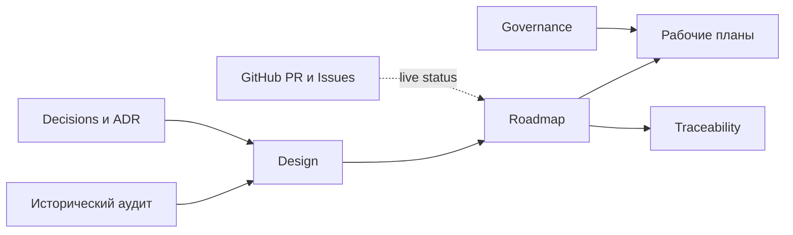

<a id="top"></a>
# Канонический пакет модернизации `mcp-local-hub`

**Дата фиксации:** 2026-08-27  
**Ветка документации:** `docs/canonical-modernization-roadmap`  
**База ветки:** [`master@83b49f4`](https://github.com/applicate2628/mcp-local-hub/commit/83b49f4d616e97613e70070bfbc62e7958c01fc4)  
**Статус:** нормативный пакет для review; production-код не изменяется  
**Зависимость:** Pull Request №602 должен быть слит до `PR-11A-02`

Этот каталог является единственной нормативной точкой входа для программы стабилизации и архитектурного упрощения. Исторический аудит остаётся неизменяемым доказательным снимком, GitHub хранит оперативный статус, а машинные связи finding → requirement → work package → acceptance test хранятся в [`traceability.yaml`](traceability.yaml).

## Оглавление

1. [Источники истины](#sources-of-truth)
2. [Состав пакета](#package)
3. [Порядок чтения](#reading-order)
4. [Система идентификаторов](#identifiers)
5. [Текущий снимок программы](#current-snapshot)
6. [Правила обновления](#update-rules)
7. [Нумерованные источники](#references)

<a id="sources-of-truth"></a>
## 1. Источники истины

| Область | Канонический источник | Что в нём хранится |
|---|---|---|
| Фактическое поведение | исходный код и тесты текущего `master` | реализованное поведение |
| Оперативный статус | GitHub Pull Request и Issues | открыто/закрыто, review, merge, blockers |
| Нормативная программа | этот каталог | цели, зависимости, критерии выхода и governance |
| Трассируемость | [`traceability.yaml`](traceability.yaml) | устойчивые связи идентификаторов |
| Архитектурный долг после A2 | `architecture/*.yaml` | policy, owners, baseline и workers |
| Историческая доказательная база | аудит снимка [`c0527c1`](#ref-1) | состояние на дату аудита; не переписывается задним числом |

Ручной `status.md` намеренно отсутствует: до окончательного решения [D-005](decisions.md#d-005) он создал бы конкурирующий оперативный реестр.

<a id="package"></a>
## 2. Состав пакета

1. [`design.md`](design.md) — конечная цель, целевая архитектура и основные инварианты.
2. [`roadmap.md`](roadmap.md) — 17 рабочих пакетов, зависимости, релизные волны и 34 архитектурных PR.
3. [`governance.md`](governance.md) — правила веток, review, локальной верификации, baseline, рисков и release evidence.
4. [`decisions.md`](decisions.md) — реестр D-001—D-016 и связь с Architecture Decision Record (ADR; записью архитектурного решения).
5. [`traceability.yaml`](traceability.yaml) — 36 findings, 236 requirements, 20 architecture acceptance tests, 16 decisions и реестр PR.
6. [`glossary.md`](glossary.md) — термины и сокращения.
7. [`plans/wp-00-to-10.md`](plans/wp-00-to-10.md) — рабочий план стабилизационных пакетов.
8. [`plans/wp-11a-to-11f.md`](plans/wp-11a-to-11f.md) — исправленный архитектурный план A1—F4.
9. [`implementation-plan.md`](implementation-plan.md) — план и журнал создания этого пакета.
10. [`adr/`](adr/) — принятые архитектурные решения.

<a id="reading-order"></a>
## 3. Порядок чтения

```text
README
  ↓
design
  ↓
roadmap
  ↓
governance
  ↓
plans
  ↓
traceability.yaml / decisions / ADR
```

<a id="figure-1"></a>


**Рисунок 1 — роли документов и направление нормативных связей.**

<a id="identifiers"></a>
## 4. Система идентификаторов

- `R-01—R-36` — результаты аудита.
- `SEC-*`, `MCP-*`, `ARCH-*` и другие — требования.
- `AT-001—AT-020` — архитектурные приёмочные тесты.
- `WP-00—WP-10`, `WP-11A—WP-11F` — рабочие пакеты.
- `PR-11A-01` и далее — нормативные идентификаторы Pull Request; `A1`, `B1` остаются короткими алиасами.
- `D-001—D-016` — решения программы.
- `ADR-0001` и далее — принятые архитектурные решения.

<a id="current-snapshot"></a>
## 5. Текущий снимок программы

| Объект | Состояние на 2026-08-27 |
|---|---|
| `master` при создании пакета | `83b49f4d616e97613e70070bfbc62e7958c01fc4` |
| `PR-11A-01` / A1 | PR №602, Codex review без замечаний, merge ещё не зафиксирован в этом документе |
| A1 reviewed HEAD | `0235deb95af170598d6572e9af5f35ab5532bc9d` |
| Следующий исполнимый PR после merge A1 | `PR-11A-02` — repository ratchet |
| Hosted CI для обычной разработки | не используется |
| Release workflow | допускается только release-only `npm-publish.yml` |

Статус review, merge и последующие SHA проверяются в GitHub, а не обновляются вручную в этом документе.

<a id="update-rules"></a>
## 6. Правила обновления

1. Изменение архитектурного решения требует ADR либо явного изменения существующего ADR.
2. Изменение зависимостей рабочих пакетов требует изменения [`roadmap.md`](roadmap.md) и [`traceability.yaml`](traceability.yaml) в одном PR.
3. Исторические факты аудита не переписываются; для текущего состояния создаётся delta-review.
4. Примеры `archcheck` должны соответствовать фактическому CLI текущего `master`.
5. GitHub Actions не добавляется для обычных PR, merge или архитектурного ratchet.
6. Каждый рисунок имеет номер и якорь; ссылки на рисунки, ADR и источники должны быть кликабельными.
7. незаполненные placeholders, пустые owners и бессрочные accepted risks запрещены.


<a id="references"></a>
## Нумерованные источники

<a id="ref-1"></a>
1. [`mcp-local-hub` — аудитируемый снимок `c0527c1`](https://github.com/applicate2628/mcp-local-hub/commit/c0527c1232180dd37cd92da5a328bdcdadae1969).
<a id="ref-2"></a>
2. [`mcp-local-hub` — снимок `master` при канонизации `83b49f4`](https://github.com/applicate2628/mcp-local-hub/commit/83b49f4d616e97613e70070bfbc62e7958c01fc4).
<a id="ref-3"></a>
3. [Pull Request №602: `archcheck` core](https://github.com/applicate2628/mcp-local-hub/pull/602).
<a id="ref-4"></a>
4. [Репозиторий `mcp-local-hub`](https://github.com/applicate2628/mcp-local-hub).
<a id="ref-5"></a>
5. [Model Context Protocol — официальная спецификация](https://modelcontextprotocol.io/specification/).


[Вернуться к началу](#top)
