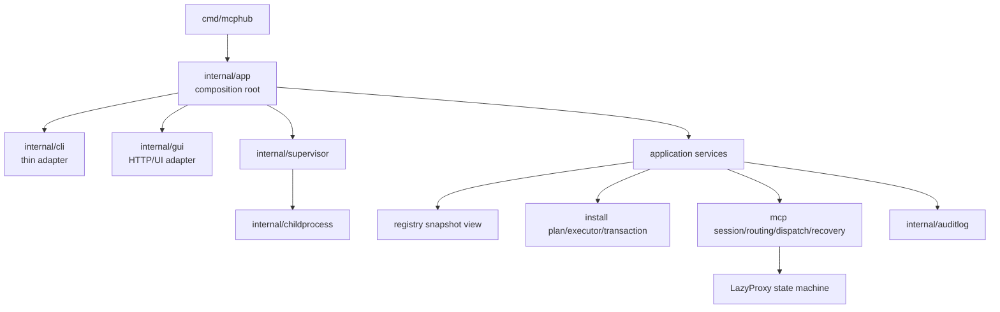
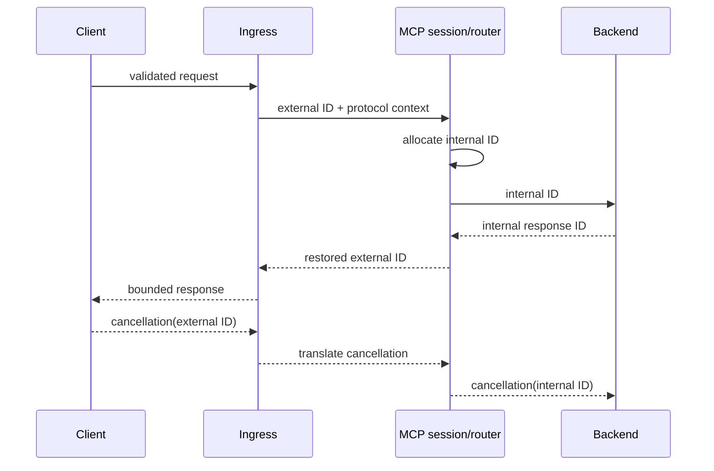
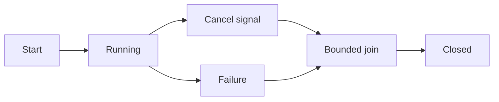

# Design программы стабилизации и архитектурного упрощения

**Нормативный уровень:** программа и целевая архитектура 
**Связанные документы:** [roadmap](roadmap.md), [governance](governance.md), [traceability](traceability.yaml)

## Оглавление

1. [Назначение](#purpose)
2. [Исходные ограничения](#constraints)
3. [Конечная цель](#goal)
4. [Архитектурные принципы](#principles)
5. [Целевая структура](#target-structure)
6. [Потоки данных](#data-flow)
7. [Владение жизненным циклом](#lifecycle)
8. [Совместимость и ошибки](#compatibility)
9. [Нецели](#non-goals)
10. [Критерии готовности 1.0](#ready-1-0)
11. [Источники](README.md#references)

## 1. Назначение

Программа переводит `mcp-local-hub` из быстро растущего интеграционного проекта в проверяемый модульный монолит. Design основан на историческом аудите снимка [`c0527c1`](README.md#ref-1), но исполняется только против актуального `master` и не переносит старые статусы без delta-review.

## 2. Исходные ограничения

- Один основной deployable product и один репозиторий.
- Go остаётся языком backend и системного runtime.
- Пользовательские CLI, HTTP, JSON и persisted-state contracts не меняются скрыто.
- Архитектурное перемещение выполняется только после characterization tests — тестов, фиксирующих текущее наблюдаемое поведение.
- Обычная разработка не использует hosted Continuous Integration (CI; непрерывную интеграцию); доказательства создаются локально.
- P0/P1 security fixes не блокируются длинной архитектурной программой.

## 3. Конечная цель

Стабильная версия 1.0 должна одновременно иметь:

1. единый защищённый ingress для локальных HTTP-входов;
2. корректное сопоставление request ID и cancellation;
3. отдельные legacy и modern Model Context Protocol (MCP; протокол контекста модели) adapters;
4. проектную изоляцию Serena;
5. один composition root — корень композиции — в `internal/app`;
6. одного владельца supervisor и process-tree lifecycle;
7. чистое InstallPlan и отдельные executor/transaction journal;
8. явную state machine `LazyProxy`;
9. отсутствие production test hooks и нового изменяемого глобального состояния;
10. полную классификацию goroutine по owner/cancel/join/bound;
11. воспроизводимую локальную release verification и доверенную публикацию;
12. единый реестр состояния и синхронизированную документацию.

## 4. Архитектурные принципы

1. **Модульный монолит.** Один продукт, явные внутренние модули и направленные зависимости — [ADR-0001](adr/0001-modular-monolith.md).
2. **Один composition root.** Production-зависимости создаются только в `internal/app` — [ADR-0002](adr/0002-single-composition-root.md).
3. **Локальные доказательства.** Обычные PR не расходуют GitHub Actions — [ADR-0003](adr/0003-local-verification.md).
4. **Ратчет вместо мгновенной чистоты.** Старый долг временно фиксируется, новый и выросший блокируется — [ADR-0004](adr/0004-architecture-ratchet.md).
5. **Сначала characterization.** Перемещение владельца не начинается без теста текущего поведения — [ADR-0005](adr/0005-characterization-before-extraction.md).
6. **Один инвариант — один production owner.** Compatibility facade допускается только с owner, expiry и removal test.
7. **История отдельно от инварианта.** В коде остаётся текущее правило; история хранится в ADR и Git.
8. **Fail closed.** Ошибка конфигурации, чтения, записи или доказательства не превращается в ложный PASS.

## 5. Целевая структура

**Рисунок 1 — целевой модульный монолит и владельцы подсистем.**

Направление зависимости идёт от composition root и adapters к предметным сервисам. Низкоуровневые runtime-модули не импортируют CLI или GUI.

## 6. Потоки данных

**Рисунок 2 — целевой поток запроса и отмены.**

## 7. Владение жизненным циклом

**Рисунок 3 — обязательный контракт фонового процесса.**

Каждая goroutine и каждый дочерний процесс имеют:

- устойчивое предметное имя;
- owner;
- trigger запуска;
- точный cancel mechanism;
- observable join;
- deadline либо другое доказуемое ограничение;
- contract test.

## 8. Совместимость и ошибки

- CLI command names, flags, stdout/stderr и exit codes сохраняются, если migration decision не утверждён отдельно.
- Error identity и persisted schema не меняются как побочный эффект package move.
- Любой временный facade регистрируется в архитектурном baseline и удаляется в заранее указанном PR.
- Ошибка записи отчёта, baseline или release evidence завершает команду неуспешно.
- Accepted risk допустим только для P2/P3, с owner, expiry, reason и компенсирующей проверкой.

## 9. Нецели

- микросервисная декомпозиция;
- новый язык backend;
- массовое переименование публичных API;
- скрытое изменение пользовательского поведения под видом refactor;
- использование `utils`/`common` как нового владельца неопределённой логики;
- автоматический GitHub CI для обычных Pull Request.

## 10. Критерии готовности 1.0

Версия 1.0 допускается, когда:

- открытых P0/P1 нет;
- все R-01—R-36 закрыты либо P2/P3 принят с owner и expiry;
- legacy/modern protocol conformance доказана;
- заявленные stable-платформы проходят native release matrix;
- Serena project isolation включена по умолчанию;
- `archcheck verify` проходит без new/grown/expired/stale/unowned;
- unclassified workers отсутствуют;
- production service graph создаётся только в `internal/app`;
- production test hooks отсутствуют;
- install/upgrade/rollback проверены на чистых средах;
- release evidence и package provenance связаны без самоссылки commit.

[Вернуться к началу](#top)
