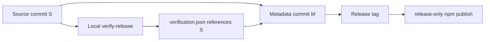

<a id="top"></a>
# Governance: исполнение, review, доказательства и выпуск

## Оглавление

1. [Источник истины](#source-of-truth)
2. [Правило одного инварианта](#one-invariant)
3. [Ветки и PR](#branches)
4. [Локальная верификация](#local-verification)
5. [Codex и security review](#review)
6. [Baseline и accepted risk](#baseline)
7. [Release evidence без самоссылки](#release-evidence)
8. [Оперативный статус](#status-model)
9. [Rollback](#rollback)
10. [Документация](#documentation)

<a id="source-of-truth"></a>
## 1. Источник истины

Иерархия задаётся в [README](README.md#sources-of-truth). При конфликте фактический код превосходит roadmap, но конфликт обязан стать отдельным PR к документации; молчаливый дрейф запрещён.

<a id="one-invariant"></a>
## 2. Правило одного инварианта

Один PR изменяет один проверяемый инвариант. В одном PR запрещено смешивать:

- package extraction и изменение внешнего поведения;
- security fix и массовую архитектурную очистку;
- новый protocol feature и перемещение владельца;
- baseline expansion и несвязанную функциональность.

Если обнаружен реальный defect во время characterization, он фиксируется отдельным issue и отдельным PR.

<a id="branches"></a>
## 3. Ветки и PR

1. Каждая ветка создаётся от актуального `master` после слияния зависимостей.
2. Длинная integration branch не является альтернативным источником истины.
3. Перед review ветка rebases/merges актуальный `master` по принятой политике и повторяет exact-HEAD gate.
4. Draft PR используется до завершения локальных проверок и self-review.
5. Merge без bypass; admin override требует явного решения владельца.
6. Документационный PR не изменяет production runtime.

<a id="local-verification"></a>
## 4. Локальная верификация

Hosted CI для обычной разработки, PR, merge и architecture ratchet не используется — [ADR-0003](adr/0003-local-verification.md).

Минимум после `PR-11A-02`:

```bash
go run ./tools/archcheck verify \
  --root . \
  --policy architecture/policy.yaml \
  --baseline architecture/baseline.yaml \
  --workers architecture/workers.yaml

go build ./...
go vet ./...
go test -count=1 -timeout 5m ./...
```

`--owners` передаётся команде `baseline`; `verify` читает ownership из baseline и не требует фиктивного параметра.

Расширенный gate для затронутых concurrency/runtime-пакетов:

```bash
go test -shuffle=on -count=20 -timeout 10m ./internal/api ./internal/cli ./internal/gui ./internal/daemon
go test -race -count=1 -timeout 15m ./internal/api ./internal/cli ./internal/gui ./internal/daemon
```

Отчёты сохраняются в `.reports/`; успешный статус без созданного обязательного отчёта запрещён.

<a id="review"></a>
## 5. Codex и security review

1. Сначала локальный gate.
2. Затем push exact HEAD.
3. Комментарий `@codex review` запускает review.
4. Все actionable findings исправляются в том же PR; новый HEAD проверяется повторно.
5. Security-sensitive PR проходит независимый deep security review.
6. Codex PASS не заменяет локальный полный test gate и merge status.

<a id="baseline"></a>
## 6. Baseline и accepted risk

- Baseline создаётся из фактического дерева текущего `master`, а не из исторического audit SHA.
- `generated_from` равен `git rev-parse HEAD` дерева, которое действительно сканировалось.
- Запись имеет owner, один primary work package, remove-by, reason и max metric при необходимости.
- Catch-all owner не считается завершённой классификацией; допустим только краткоживущий triage owner.
- Новая запись не добавляется автоматически как способ «починить» failing gate.
- Исчезнувшая запись удаляется тем же PR.
- Worker хранится либо в baseline как временный legacy debt, либо в `workers.yaml`, но не в обоих местах.
- Accepted risk для P0/P1 запрещён; P2/P3 требует owner, expiry и компенсирующей проверки.

<a id="release-evidence"></a>
## 7. Release evidence без самоссылки

Коммит не может содержать manifest со своим собственным commit SHA. Поэтому используется двухкоммитный протокол:

1. `S` — чистый release source commit с версией и changelog.
2. Локальный `verify-release` выполняет полный gate на `S` и создаёт `release/verification.json` с `source_commit: S`.
3. `M` — metadata commit, родителем которого является `S`; diff `S..M` содержит только разрешённые release metadata и manifest.
4. Release tag указывает на `M`.
5. Release-only `npm-publish.yml` проверяет: parent(`M`) = `S`, allowlist diff, manifest `source_commit = S`, hashes и package payload.
6. Production code build берётся из `M`; различие от `S` ограничено метаданными и не меняет runtime.

<a id="figure-1"></a>


**Рисунок 1 — release evidence без невозможной самоссылки commit.**

<a id="status-model"></a>
## 8. Оперативный статус

До окончательного решения [D-005](decisions.md#d-005):

- GitHub PR и Issues — оперативный статус;
- документы — нормативный план;
- `traceability.yaml` — устойчивые связи;
- audit snapshot — историческое доказательство.

Статусы разделяются:

```text
review_status
local_gate_status
merge_status
release_status
```

Одно слово `PASS` не используется как замена всем четырём состояниям.

<a id="rollback"></a>
## 9. Rollback

- Documentation-only: revert одного commit.
- Guardrails/baseline: revert одного PR, production runtime не меняется.
- Characterization: revert test/registry PR, но выявленный defect не удаляется без issue.
- Extraction: revert конкретного owner migration; compatibility facade сохраняется до removal PR.
- Removal gate: при регрессии восстанавливается только нужный facade отдельным emergency PR с новым expiry.

<a id="documentation"></a>
## 10. Документация

- Каждый рисунок имеет номер, caption и якорь.
- Все оглавления кликабельны.
- Сокращение расшифровывается при первом использовании и присутствует в [глоссарии](glossary.md).
- Ссылки finding/requirement/WP/PR/ADR проверяются на существование.
- незаполненные placeholders и бессрочные исключения и ложные команды запрещены.
- Изменение decision требует обновить [`decisions.md`](decisions.md) и соответствующий ADR.

[Вернуться к началу](#top)
