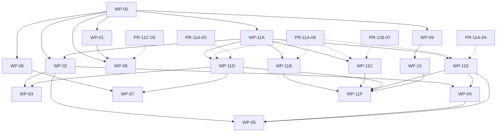

# Roadmap программы модернизации

## Оглавление

1. [Масштаб программы](#scale)
2. [Семантика зависимостей](#dependency-semantics)
3. [Граф рабочих пакетов](#dependency-graph)
4. [Рабочие пакеты](#work-packages)
5. [Релизные волны](#release-waves)
6. [Архитектурный PR registry](#pr-registry)
7. [Правила delta/JIT-планирования](#jit-planning)
8. [Конечная граница](#final-boundary)

## 1. Масштаб программы

Определены:

- 17 рабочих пакетов: `WP-00—WP-10` и `WP-11A—WP-11F`;
- 36 неизменяемых audit findings `R-01—R-36`;
- 7 post-audit delta entries `DELTA-001—DELTA-007`;
- 236 требований с полными формулировками;
- 20 архитектурных приёмочных тестов;
- 17 решений `D-001—D-017`;
- 34 архитектурных PR для `WP-11A—WP-11F`.

Число PR для всей программы не фиксируется до delta-review конкретного WP.

## 2. Семантика зависимостей

Нужно различать:

- **start_after** — минимальное условие, после которого можно открыть первую ветку WP;
- **decision gate** — решение `D-*`, обязательное до начала или конкретной части WP;
- **delta gate** — post-audit факт `DELTA-*`, требующий явно указанной revalidation;
- **lane gate** — дополнительное условие только для конкретной части WP;
- **merge dependency** — exact PR, без которого следующий PR не сливается.

Машинные поля `decision_gates`, `delta_gates`, `pr_gates`, `deps` и `wp_gates` файла [`traceability.yaml`](traceability.yaml) нормативны. Неявное наследование запрещено.

Это устраняет ложные утверждения вида «весь WP-11C зависит от всего WP-11B». Например:

- `PR-11C-01` может начаться после `PR-11A-06`;
- extraction `PR-11C-02` дополнительно ждёт `PR-11B-07`;
- install lane WP-11D ждёт завершения `PR-11A-06` и characterization `PR-11A-03`;
- WP-11E начинает подготовку после WP-11A, но implementation lanes ждут завершения `PR-11A-06`; routing lane дополнительно ждёт `PR-11A-04` и WP-02.

## 3. Граф рабочих пакетов

**Рисунок 1 — полные `start_after` связи и дополнительные PR lane gates.**

## 4. Рабочие пакеты

| ID | Название | Может начаться после | Дополнительные decision/delta/PR gates | Критерий выхода | Planning status |
|---|---|---|---|---|---|
| `WP-00` | Базовая воспроизводимость и тестовая изоляция | — | `DELTA-002` | Одна локальная команда доказывает состояние; тесты не затрагивают реальные конфигурации. | `revalidate-after-PR604` |
| `WP-01` | Единая входная безопасность и framing | `WP-00` | `D-001`, `D-004`, `D-009` | Все local ingress используют одну admission/framing policy. | `security-revalidation` |
| `WP-02` | Correlation router и cancellation | `WP-00`, `WP-11A` | `D-008`, `DELTA-001` | ID/cancellation/session ownership однозначен. | `planned` |
| `WP-03` | Sharing policy и Serena project pool | `WP-02`, `WP-11D` | `D-003`, `DELTA-002` | Проекты изолированы; existing Serena projection revalidated and reused. | `current-master-delta` |
| `WP-04` | Разделение legacy и modern MCP | `WP-02`, `WP-11E` | `D-002`, `DELTA-006` | Каждая рекламируемая MCP epoch имеет отдельный tested adapter. | `open-delta` |
| `WP-05` | Точность capabilities, списков и caching | `WP-02`, `WP-04`, `WP-11E` | `DELTA-007` | Capabilities и route map публикуются из согласованного snapshot. | `planned` |
| `WP-06` | Единый audit writer | `WP-00` | `D-010` | Audit append/sync/unlock/health имеют одного owner. | `planned` |
| `WP-07` | Crash-safe adoption/de-adoption | `WP-06`, `WP-11D` | `D-017`, `DELTA-002`, `DELTA-003` | Transaction завершается commit, rollback или recovery-required. | `current-master-delta` |
| `WP-08` | Platform lifecycle | `WP-00`, `WP-01` | `D-006`, `D-017`, `PR-11C-03`, `DELTA-004`, `DELTA-005`, `DELTA-006` | Process trees, deadlines, durable output и platform containment доказаны. | `open-deltas` |
| `WP-09` | Release и supply chain | `WP-00` | `D-006`, `D-007`, `DELTA-002` | Pins, descriptors, SBOM, licenses и release verification связаны. | `foundation-present` |
| `WP-10` | Документация и управление состоянием проекта | `WP-09` | `D-005`, `DELTA-002`, `DELTA-006` | Один status owner; docs/version/capability matrices синхронизированы. | `planned` |
| `WP-11A` | Architecture guardrails и инвентаризация | `WP-00` | `D-011`, `D-013`, `D-014`, `DELTA-002`, `DELTA-004` | Новый Go architectural debt блокируется; behavior и Go workers инвентаризованы. | `A1-in-PR` |
| `WP-11B` | Корень композиции и внедрение зависимостей | `WP-11A` | `D-012`, `D-016`, `PR-11A-06`, `DELTA-001` | Service graph создаётся только в internal/app; global test seams удалены. | `planned` |
| `WP-11C` | Supervisor и child-process extraction | `WP-11A` | `PR-11B-07`, `DELTA-001`, `DELTA-004`, `DELTA-005`; `WP-01` до transport migration | CLI thin; один child-process owner; route/stdio/http lifecycle сохранён. | `current-route-contract` |
| `WP-11D` | Registry view и install architecture | `WP-11A` | `PR-11A-03`, `PR-11A-06`, `DELTA-002` | Reload concurrency реализована один раз; planning отделён от effects. | `current-master-delta` |
| `WP-11E` | MCP и LazyProxy decomposition | `WP-11A` | `D-015`, `PR-11A-04`, `PR-11A-06`, `WP-02`, `DELTA-001`, `DELTA-006` | Session/routing/dispatch/recovery разделены; LazyProxy state explicit. | `current-route-contract` |
| `WP-11F` | Удаление временных путей и hard enforcement | `WP-11B`, `WP-11C`, `WP-11D`, `WP-11E`, `WP-10` | `PR-11F-01..04` | Facades/allowlists/dead code удалены; tests сгруппированы по контрактам. | `planned` |

## 5. Релизные волны

| Волна | Основной состав | Допуск |
|---|---|---|
| 0 | WP-00 subset, WP-01 P0 revalidation | внутренний security hotfix |
| 1 | WP-02, WP-11A, начало WP-11B, release foundation | публичная beta |
| 2 | WP-03, WP-06, WP-08, WP-11C, WP-11D | multi-project beta |
| 3 | WP-04, WP-11E | protocol beta |
| 4 | WP-05, WP-07, остальной WP-09, WP-10 | release candidate; canonical status/docs готовы до removal gates |
| 5 | WP-11F, финальный security/architecture review | stable 1.0 |

Волны являются последовательными release envelopes: пакет из более поздней волны не начинается до exit criteria всех своих `start_after`, даже если они перечислены в предыдущей волне.

Номера версий не являются контрактом. Состав волны корректируется после exact-master revalidation.

## 6. Архитектурный PR registry

PR готов к merge только когда одновременно выполнены его `Merge dependencies` и все `WP gates`. Поле `WP gates` обязательно дублируется в `architecture_prs.*.wp_gates` файла [`traceability.yaml`](traceability.yaml); неявное наследование зависимостей запрещено.

| ID | WP | Ветка | Результат | Merge dependencies | WP gates | Planning status |
|---|---|---|---|---|---|---|
| `PR-11A-01` / `A1` | `WP-11A` | `arch/wp11a-archcheck-core` | Детерминированное ядро archcheck | — | — | `implemented-in-pr` |
| `PR-11A-02` / `A2` | `WP-11A` | `arch/wp11a-repository-ratchet` | Production policy, owners, baseline, Go workers и локальный ratchet | `PR-11A-01` | — | `planned` |
| `PR-11A-03` / `A3` | `WP-11A` | `test/wp11a-supervisor-install-contracts` | Supervisor/install characterization и общий golden helper | `PR-11A-02` | — | `planned` |
| `PR-11A-04` / `A4` | `WP-11A` | `test/wp11a-mcp-lazy-contracts` | MCP aggregator/LazyProxy characterization | `PR-11A-02` | — | `planned` |
| `PR-11A-05` / `A5` | `WP-11A` | `test/wp11a-critical-worker-contracts` | Критические Go worker contracts | `PR-11A-02` | — | `planned` |
| `PR-11A-06` / `A6` | `WP-11A` | `arch/wp11a-complete-worker-inventory` | Полный Go workers.yaml и zero-unclassified gate | `PR-11A-03`, `PR-11A-04`, `PR-11A-05` | — | `planned` |
| `PR-11B-01` / `B1` | `WP-11B` | `refactor/wp11b-composition-root` | Production composition root internal/app | `PR-11A-06` | — | `planned` |
| `PR-11B-02` / `B2` | `WP-11B` | `refactor/wp11b-cli-readonly-deps` | Shared API для read-only CLI | `PR-11B-01` | — | `planned` |
| `PR-11B-03` / `B3` | `WP-11B` | `refactor/wp11b-cli-mutation-deps` | Shared API для mutating CLI | `PR-11B-02` | — | `planned` |
| `PR-11B-04` / `B4` | `WP-11B` | `refactor/wp11b-gui-services` | Process-scoped GUI Services | `PR-11B-03` | — | `planned` |
| `PR-11B-05` / `B5` | `WP-11B` | `refactor/wp11b-gui-route-wiring` | Перевод существующих GUI и mcphub route на shared service graph | `PR-11B-04` | — | `planned` |
| `PR-11B-06` / `B6` | `WP-11B` | `refactor/wp11b-testkit` | Общий process test harness | `PR-11B-05` | — | `planned` |
| `PR-11B-07` / `B7` | `WP-11B` | `refactor/wp11b-supervisor-deps` | Instance-owned supervisor dependencies | `PR-11B-06` | — | `planned` |
| `PR-11B-08` / `B8` | `WP-11B` | `refactor/wp11b-remove-facades` | Удаление compatibility facades и production test hooks | `PR-11B-07` | — | `planned` |
| `PR-11C-01` | `WP-11C` | `refactor/wp11c-supervise-inpackage-split` | Механическое разделение supervise.go внутри internal/cli | `PR-11A-06` | — | `planned` |
| `PR-11C-02` | `WP-11C` | `refactor/wp11c-supervisor-core` | Извлечение internal/supervisor с compatibility facade | `PR-11C-01`, `PR-11B-07` | — | `planned` |
| `PR-11C-03` | `WP-11C` | `refactor/wp11c-childprocess-core` | Общий internal/childprocess и межъязыковой lifecycle contract | `PR-11C-02` | WP-01 | `planned` |
| `PR-11C-04` | `WP-11C` | `refactor/wp11c-stdio-host-runner` | Миграция StdioHost на childprocess runner | `PR-11C-03` | — | `planned` |
| `PR-11C-05` | `WP-11C` | `refactor/wp11c-http-host-runner` | Миграция HTTPHost и удаление duplicate lifecycle owners | `PR-11C-04` | — | `planned` |
| `PR-11D-01` | `WP-11D` | `refactor/wp11d-registry-snapshot-view` | Общий RegistrySnapshotView с monotonic publish | `PR-11A-06` | — | `planned` |
| `PR-11D-02` | `WP-11D` | `refactor/wp11d-serena-registry-view` | Миграция существующей Serena projection/resolver | `PR-11D-01` | — | `planned` |
| `PR-11D-03` | `WP-11D` | `refactor/wp11d-lsp-registry-view` | Миграция LSP resolver | `PR-11D-01` | — | `planned` |
| `PR-11D-04` | `WP-11D` | `refactor/wp11d-install-plan` | Pure InstallPlan extraction с сохранением settlement contracts | `PR-11A-03`, `PR-11A-06` | — | `planned` |
| `PR-11D-05` | `WP-11D` | `refactor/wp11d-install-transaction` | Executor и transaction journal | `PR-11D-04` | — | `planned` |
| `PR-11D-06` | `WP-11D` | `refactor/wp11d-remove-duplicates` | Удаление duplicate reload/client/process helpers | `PR-11D-02`, `PR-11D-03`, `PR-11D-05` | — | `planned` |
| `PR-11E-01` | `WP-11E` | `refactor/wp11e-mcp-session-routing` | Разделение protocol/session/routing существующего route daemon | `PR-11A-04`, `PR-11A-06` | WP-02 | `planned` |
| `PR-11E-02` | `WP-11E` | `refactor/wp11e-mcp-dispatch-recovery` | Разделение fanout/dispatch/recovery | `PR-11E-01` | — | `planned` |
| `PR-11E-03` | `WP-11E` | `refactor/wp11e-lazy-state-machine` | Typed LazyProxy state/event reducer | `PR-11A-04`, `PR-11A-06` | — | `planned` |
| `PR-11E-04` | `WP-11E` | `refactor/wp11e-timeout-lifecycle` | Централизация timeout и lifecycle policy | `PR-11E-02`, `PR-11E-03` | WP-08 | `planned` |
| `PR-11E-05` | `WP-11E` | `refactor/wp11e-docs-comments` | Вынос embedded Markdown и исторических комментариев | `PR-11E-04` | WP-10 | `planned` |
| `PR-11F-01` | `WP-11F` | `refactor/wp11f-remove-facades` | Удаление оставшихся compatibility facades | `PR-11B-08`, `PR-11C-05`, `PR-11D-06`, `PR-11E-05` | — | `planned` |
| `PR-11F-02` | `WP-11F` | `refactor/wp11f-hard-gates` | Закрытие allowlist и включение hard gates | `PR-11F-01` | — | `planned` |
| `PR-11F-03` | `WP-11F` | `refactor/wp11f-contract-tests` | Перегруппировка тестов по устойчивым контрактам, включая codex_round* | `PR-11F-01` | — | `planned` |
| `PR-11F-04` | `WP-11F` | `refactor/wp11f-final-audit` | Независимый architecture review и dead-code sweep | `PR-11F-02`, `PR-11F-03` | — | `planned` |

`implemented-in-pr` означает только наличие реализации в отдельном PR. Review PASS, локальный full gate и merge status являются разными состояниями.

## 7. Правила delta/JIT-планирования

Перед первым implementation PR каждого WP:

1. зафиксировать exact `master` SHA;
2. сравнить его с audit snapshot;
3. учесть все слитые hotfix/release PR;
4. проверить открытые PR exact HEAD;
5. закрытые/unmerged ветки рассматривать только как evidence;
6. revalidate связанные `R-*`;
7. зарегистрировать новые факты как `DELTA-*`;
8. выполнить characterization/falsifier tests;
9. определить PR decomposition по одному инварианту;
10. обновить `traceability.yaml`.

PR №604 изменил 351 файл и более 53 тысяч добавленных строк, поэтому A2 обязан выполнить свежий inventory. Старые владельцы, пути и числа из аудита не переносятся автоматически.

## 8. Конечная граница

Программа завершена, когда:

- все WP прошли exit criteria;
- нет открытых P0/P1;
- все `R-*` и `DELTA-*` имеют доказанный outcome;
- локальные architecture/release gates воспроизводимы;
- один production owner существует для каждого инварианта;
- Go workers и cross-language processes полностью классифицированы;
- временные facades и allowlists удалены либо допустимый P3 имеет owner+expiry;
- stable platform matrix и документация соответствуют продукту.

[Вернуться к началу](#top)
