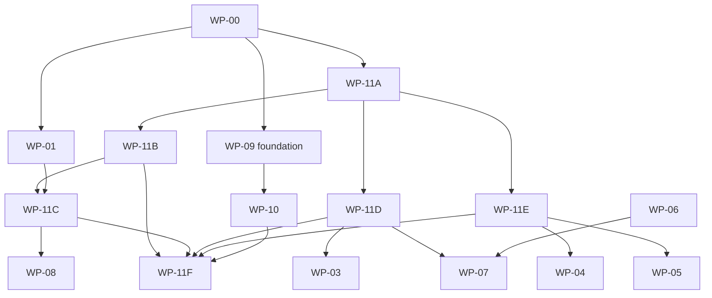
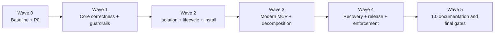

# Roadmap программы модернизации

## Оглавление

1. [Масштаб программы](#scale)
2. [Граф зависимостей](#dependency-graph)
3. [Рабочие пакеты](#work-packages)
4. [Релизные волны](#release-waves)
5. [Архитектурный PR registry](#pr-registry)
6. [Правила детализации WP-00—WP-10](#jit-planning)
7. [Конечная граница](#final-boundary)

## 1. Масштаб программы

На текущем уровне планирования определены:

- **17 рабочих пакетов:** `WP-00—WP-10` и `WP-11A—WP-11F`;
- **36 findings:** `R-01—R-36`;
- **236 нормативных требований**;
- **20 архитектурных приёмочных тестов:** `AT-001—AT-020`;
- **16 решений:** `D-001—D-016`;
- **272 управляемых идентификатора** требований, тестов и решений суммарно;
- **34 архитектурных PR** для `WP-11A—WP-11F`;
- **6 релизных волн**.

Точное число PR всей программы намеренно не фиксируется до delta-review соответствующего рабочего пакета. Пункты разных WP имеют разный масштаб; искусственное равенство «одна строка roadmap = один PR» запрещено.

## 2. Граф зависимостей

**Рисунок 1 — ориентированный ациклический граф основных зависимостей.**

`WP-11D` и `WP-11E` могут идти параллельно с частью `WP-11B`. `WP-11C` начинается после instance-owned supervisor dependencies (`PR-11B-07`), а не обязательно после полного B8. `WP-11F` является общей точкой удаления временных путей.

## 3. Рабочие пакеты

| ID | Название | Зависит от | Критерий выхода |
|---|---|---|---|
| `WP-00` | Базовая воспроизводимость и тестовая изоляция | — | Одна локальная команда доказывает состояние репозитория; тесты не затрагивают реальные конфигурации. |
| `WP-01` | Единая входная безопасность и framing | `WP-00` | Все локальные входы используют одну политику admission; сообщения ограничены и типизированы. |
| `WP-02` | Correlation router и cancellation | `WP-00`, `WP-11A` | Внешние и внутренние идентификаторы сопоставляются однозначно; отмена достигает backend. |
| `WP-03` | Sharing policy и Serena project pool | `WP-02`, `WP-11D` | Проекты изолированы; маршрутизация и лимиты экземпляров формализованы. |
| `WP-04` | Разделение legacy и modern MCP | `WP-02`, `WP-11E` | Каждая рекламируемая версия имеет отдельный адаптер и conformance evidence. |
| `WP-05` | Точность capabilities, списков и caching | `WP-02`, `WP-04`, `WP-11E` | Capabilities и route map публикуются из одного согласованного snapshot. |
| `WP-06` | Единый audit writer | `WP-00` | Запись, синхронизация, unlock и health имеют одного владельца и типизированный результат. |
| `WP-07` | Crash-safe adoption/de-adoption | `WP-06`, `WP-11D` | Каждая транзакция завершается commit, rollback или recovery-required с однозначным resume. |
| `WP-08` | Platform lifecycle | `WP-00`, `WP-01`, `WP-11C` | Деревья процессов, deadlines и platform containment проверены на заявленных платформах. |
| `WP-09` | Release и supply chain | `WP-00` | Локальная release verification, immutable pins, SBOM, licenses и trusted publishing связаны с релизом. |
| `WP-10` | Документация и управление состоянием проекта | `WP-09` | Один реестр состояния; версии, capabilities и документация синхронизированы. |
| `WP-11A` | Architecture guardrails и инвентаризация | `WP-00` | Новый архитектурный долг блокируется; поведение зафиксировано; workers классифицированы. |
| `WP-11B` | Корень композиции и внедрение зависимостей | `WP-11A` | Production service graph создаётся только в internal/app; global test seams удалены. |
| `WP-11C` | Supervisor и child-process extraction | `WP-11A`, `WP-11B`, `WP-01` | CLI становится thin adapter; один process-tree owner обслуживает transports. |
| `WP-11D` | Registry view и install architecture | `WP-11A` | Reload concurrency реализована один раз; planning отделён от effects и transaction journal. |
| `WP-11E` | MCP и LazyProxy decomposition | `WP-11A`, `WP-02` | Session, routing, dispatch и recovery разделены; LazyProxy имеет явную state machine. |
| `WP-11F` | Удаление временных путей и hard enforcement | `WP-11B`, `WP-11C`, `WP-11D`, `WP-11E`, `WP-10` | Нет двух production owners; allowlist закрыт; dead code и историческая структура тестов очищены. |

## 4. Релизные волны

**Рисунок 2 — рекомендуемые релизные волны; номера версий являются ориентиром, а не контрактом.**

| Волна | Основной состав | Допуск |
|---|---|---|
| 0 | `WP-00` subset, `WP-01` P0 | внутренний security hotfix |
| 1 | `WP-02`, `WP-11A`, начало `WP-11B`, pin/release foundation | публичная beta |
| 2 | `WP-03`, `WP-05`, `WP-06`, `WP-08`, `WP-11C`, `WP-11D` | multi-project beta |
| 3 | `WP-04`, `WP-11E` | protocol beta |
| 4 | `WP-07`, остальной `WP-09`, `WP-11F` | release candidate |
| 5 | `WP-10`, финальный security/architecture review | stable 1.0 |

## 5. Архитектурный PR registry

| ID | WP | Ветка | Результат | Зависит от | Planning status |
|---|---|---|---|---|---|
| `PR-11A-01` / `A1` | `WP-11A` | `arch/wp11a-archcheck-core` | Детерминированное ядро archcheck | — | implemented-in-pr |
| `PR-11A-02` / `A2` | `WP-11A` | `arch/wp11a-repository-ratchet` | Production policy, owners, baseline, workers и локальный ratchet | `PR-11A-01` | planned |
| `PR-11A-03` / `A3` | `WP-11A` | `test/wp11a-supervisor-install-contracts` | Supervisor/install characterization и общий golden helper | `PR-11A-02` | planned |
| `PR-11A-04` / `A4` | `WP-11A` | `test/wp11a-mcp-lazy-contracts` | MCP aggregator/LazyProxy characterization | `PR-11A-02` | planned |
| `PR-11A-05` / `A5` | `WP-11A` | `test/wp11a-critical-worker-contracts` | Критические worker contracts | `PR-11A-02` | planned |
| `PR-11A-06` / `A6` | `WP-11A` | `arch/wp11a-complete-worker-inventory` | Полный workers.yaml и zero-unclassified gate | `PR-11A-03`, `PR-11A-04`, `PR-11A-05` | planned |
| `PR-11B-01` / `B1` | `WP-11B` | `refactor/wp11b-composition-root` | Production composition root internal/app | `PR-11A-06` | planned |
| `PR-11B-02` / `B2` | `WP-11B` | `refactor/wp11b-cli-readonly-deps` | Shared API для read-only CLI | `PR-11B-01` | planned |
| `PR-11B-03` / `B3` | `WP-11B` | `refactor/wp11b-cli-mutation-deps` | Shared API для mutating CLI | `PR-11B-02` | planned |
| `PR-11B-04` / `B4` | `WP-11B` | `refactor/wp11b-gui-services` | Process-scoped GUI Services | `PR-11B-03` | planned |
| `PR-11B-05` / `B5` | `WP-11B` | `refactor/wp11b-gui-route-wiring` | GUI и route daemon через shared services | `PR-11B-04` | planned |
| `PR-11B-06` / `B6` | `WP-11B` | `refactor/wp11b-testkit` | Общий process test harness | `PR-11B-05` | planned |
| `PR-11B-07` / `B7` | `WP-11B` | `refactor/wp11b-supervisor-deps` | Instance-owned supervisor dependencies | `PR-11B-06` | planned |
| `PR-11B-08` / `B8` | `WP-11B` | `refactor/wp11b-remove-facades` | Удаление compatibility facades и production test hooks | `PR-11B-07` | planned |
| `PR-11C-01` | `WP-11C` | `refactor/wp11c-supervise-inpackage-split` | Механическое разделение supervise.go внутри internal/cli | `PR-11A-06` | planned |
| `PR-11C-02` | `WP-11C` | `refactor/wp11c-supervisor-core` | Извлечение internal/supervisor с compatibility facade | `PR-11C-01`, `PR-11B-07` | planned |
| `PR-11C-03` | `WP-11C` | `refactor/wp11c-childprocess-core` | Общий internal/childprocess | `PR-11C-02`, `WP-01` | planned |
| `PR-11C-04` | `WP-11C` | `refactor/wp11c-stdio-host-runner` | Миграция StdioHost на childprocess runner | `PR-11C-03` | planned |
| `PR-11C-05` | `WP-11C` | `refactor/wp11c-http-host-runner` | Миграция HTTPHost и удаление duplicate lifecycle owners | `PR-11C-04` | planned |
| `PR-11D-01` | `WP-11D` | `refactor/wp11d-registry-snapshot-view` | Общий RegistrySnapshotView | `PR-11A-06` | planned |
| `PR-11D-02` | `WP-11D` | `refactor/wp11d-serena-registry-view` | Миграция Serena resolver | `PR-11D-01` | planned |
| `PR-11D-03` | `WP-11D` | `refactor/wp11d-lsp-registry-view` | Миграция LSP resolver | `PR-11D-01` | planned |
| `PR-11D-04` | `WP-11D` | `refactor/wp11d-install-plan` | Pure InstallPlan extraction | `PR-11A-03` | planned |
| `PR-11D-05` | `WP-11D` | `refactor/wp11d-install-transaction` | Executor и transaction journal | `PR-11D-04` | planned |
| `PR-11D-06` | `WP-11D` | `refactor/wp11d-remove-duplicates` | Удаление duplicate reload/client/process helpers | `PR-11D-02`, `PR-11D-03`, `PR-11D-05` | planned |
| `PR-11E-01` | `WP-11E` | `refactor/wp11e-mcp-session-routing` | Разделение protocol/session/routing | `PR-11A-04`, `WP-02` | planned |
| `PR-11E-02` | `WP-11E` | `refactor/wp11e-mcp-dispatch-recovery` | Разделение fanout/dispatch/recovery | `PR-11E-01` | planned |
| `PR-11E-03` | `WP-11E` | `refactor/wp11e-lazy-state-machine` | Typed LazyProxy state/event reducer | `PR-11A-04` | planned |
| `PR-11E-04` | `WP-11E` | `refactor/wp11e-timeout-lifecycle` | Централизация timeout и lifecycle policy | `PR-11E-02`, `PR-11E-03`, `WP-08` | planned |
| `PR-11E-05` | `WP-11E` | `refactor/wp11e-docs-comments` | Вынос embedded Markdown и исторических комментариев | `PR-11E-04`, `WP-10` | planned |
| `PR-11F-01` | `WP-11F` | `refactor/wp11f-remove-facades` | Удаление оставшихся compatibility facades | `PR-11B-08`, `PR-11C-05`, `PR-11D-06`, `PR-11E-05` | planned |
| `PR-11F-02` | `WP-11F` | `refactor/wp11f-hard-gates` | Закрытие allowlist и включение hard gates | `PR-11F-01` | planned |
| `PR-11F-03` | `WP-11F` | `refactor/wp11f-contract-tests` | Перегруппировка тестов по устойчивым контрактам | `PR-11F-01` | planned |
| `PR-11F-04` | `WP-11F` | `refactor/wp11f-final-audit` | Независимый architecture review и dead-code sweep | `PR-11F-02`, `PR-11F-03` | planned |

`implemented-in-pr` означает, что реализация существует в отдельном PR; review, merge и локальный полный gate подтверждаются отдельно в GitHub.

## 6. Правила детализации WP-00—WP-10

Для каждого пакета перед первым implementation PR выполняется:

1. delta-review актуального `master` против finding snapshot;
2. подтверждение или закрытие связанных R-*;
3. выбор решений D-* с наступившим сроком;
4. characterization/falsifier tests;
5. PR decomposition по одному архитектурному или поведенческому инварианту;
6. обновление [`traceability.yaml`](traceability.yaml).

Таким образом roadmap остаётся полным на уровне результатов и зависимостей, но не закрепляет устаревающие file-by-file предположения на месяцы вперёд.

## 7. Конечная граница

Программа завершена, когда одновременно:

- все заявленные work packages имеют выполненные exit criteria;
- GitHub не содержит открытых P0/P1;
- архитектурный и release gates воспроизводимы локально;
- один production owner существует для каждого инварианта;
- временные facades и allowlists удалены либо формально приняты как P3 risk с expiry;
- stable release matrix и документация соответствуют фактическому продукту.

[Вернуться к началу](#top)
